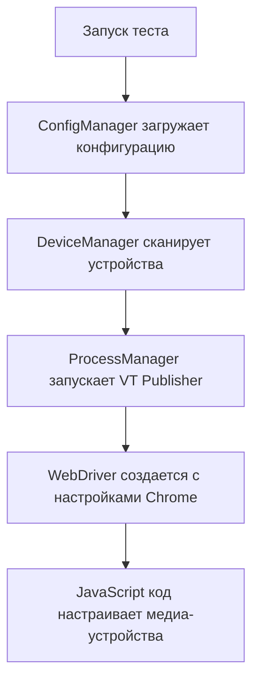
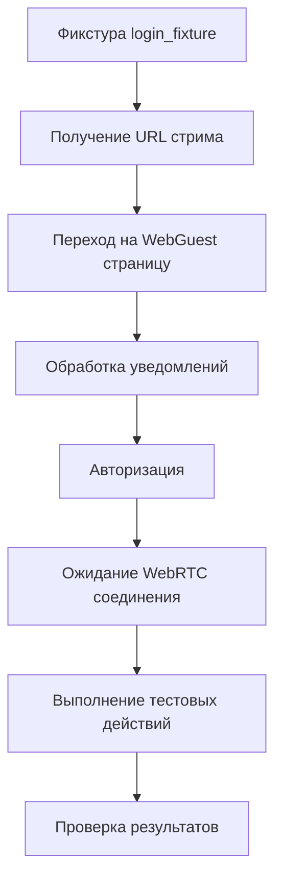
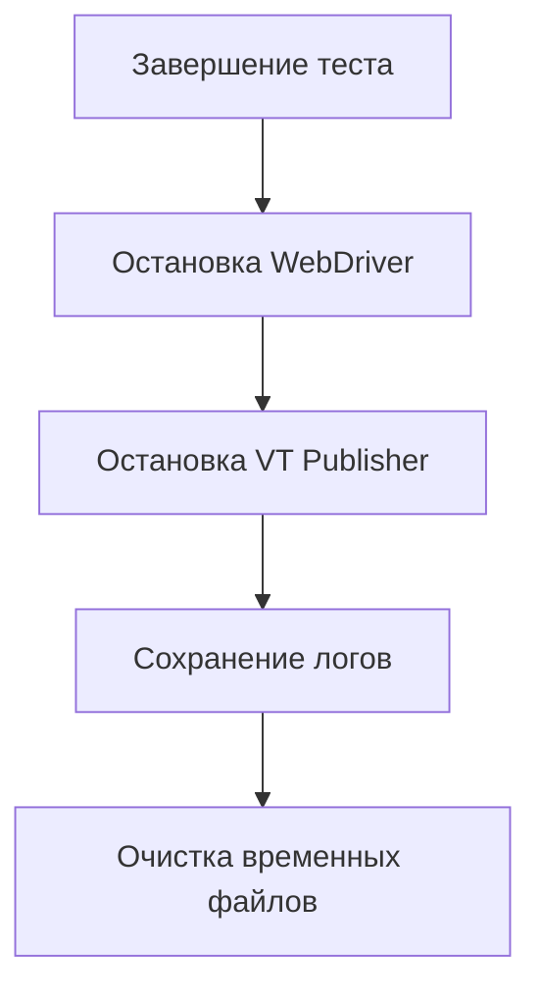

# Архитектура проекта

Структура кода и принципы работы VT WebGuest Autotests.

## Общая архитектура

```
vt_at_webguest/
├── docs/                    # Документация
├── scripts/                 # Скрипты установки и запуска
├── test/                    # Тесты (smoke, regression)
├── utils/                   # Утилиты и конфигурация
├── pages/                   # Page Object Model
├── logs/                    # Логи тестов
├── .tools/                  # Автоматически скачанные инструменты
└── .venv/                   # Виртуальное окружение Python
```

## Основные компоненты

### 1. Система конфигурации

#### ConfigManager (`utils/config_manager.py`)

**Назначение**: Централизованное управление конфигурацией

**Ключевые классы**:
- `BrowserConfig` - настройки браузера
- `DesktopAppConfig` - настройки VT Publisher
- `MediaDevicesConfig` - настройки медиа-устройств
- `TestConfig` - настройки тестов

**Принципы работы**:
1. **Приоритет настроек**: Переменные окружения → Автопоиск → Значения по умолчанию
2. **Валидация**: Проверка всех путей и настроек при загрузке
3. **Кэширование**: Сохранение найденных путей для повторного использования

#### DeviceManager (`utils/device_manager.py`)

**Назначение**: Автоматическое определение медиа-устройств

**Ключевые методы**:
- `get_all_devices()` - получение списка всех устройств
- `find_device_by_name()` - поиск устройства по имени
- `find_video_device_by_name()` - поиск видеоустройства
- `find_audio_device_by_name()` - поиск аудиоустройства

**Принципы работы**:
1. **Сканирование через PowerShell/WMI**: Получение списка устройств из системы
2. **Фильтрация по типу**: Разделение на видео и аудио устройства
3. **Поиск по частичному совпадению**: Гибкий поиск по имени
4. **Генерация ID**: Создание уникальных идентификаторов

### 2. Page Object Model

#### BasePage (`pages/base_page.py`)

**Назначение**: Базовый класс для всех страниц

**Ключевые методы**:
- `wait_for_element()` - ожидание появления элемента
- `click()` - клик по элементу с обработкой ошибок
- `send_keys()` - ввод текста
- `get_text()` - получение текста элемента

**Принципы**:
- **Единообразный API**: Все страницы используют одинаковые методы
- **Автоматические повторы**: Встроенная логика повторных попыток
- **Подробное логирование**: Запись всех действий для отладки

#### WebGuestPage (`pages/web_guest_page.py`)

**Назначение**: Работа с WebGuest интерфейсом

**Ключевые локаторы**:
- Элементы авторизации (LOGIN_FIELD, LOCATION_FIELD)
- Элементы управления стримом (START_BUTTON, STOP_BUTTON)
- Настройки качества (RESOLUTION_COMBOBOX, FRAMERATE_COMBOBOX)
- Медиа-устройства (INPUT_CAMERA_COMBOBOX, INPUT_MICROPHONE_COMBOBOX)

**Специализированные методы**:
- `select_camera()` - выбор камеры
- `select_microphone()` - выбор микрофона
- `get_volume_fader_value()` - получение значения громкости
- `is_fullscreen()` - проверка полноэкранного режима

### 3. Система тестирования

#### Фикстуры (`utils/conftest.py`)

**Основные фикстуры**:

##### `driver`
- Создание WebDriver с настройками Chrome
- Автоматическая настройка медиа-устройств через JavaScript
- Максимизация окна для стабильной работы

##### `login_fixture`
- Полный цикл авторизации в WebGuest
- Запуск VT Publisher
- Получение URL стрима
- Ожидание готовности WebRTC соединения

##### `web_guest_page_setup`
- Создание объектов для работы с WebGuest
- Инициализация обработчиков уведомлений и стримов

#### Обработчики

##### StreamHandler (`utils/webrtc_stream_handler.py`)
- Мониторинг WebRTC соединений
- Ожидание готовности стрима
- Проверка состояния медиа-потоков

##### NotificationHandler (`utils/notificaton_handler.py`)
- Обработка уведомлений браузера
- Автоматическое закрытие ненужных уведомлений
- Логирование важных сообщений

##### ProcessManager (`utils/process_handler.py`)
- Управление процессом VT Publisher
- Автоматический запуск и остановка
- Очистка конфигурационных файлов

### 4. Система логирования

#### LoggerConfig (`utils/logger_config.py`)

**Назначение**: Централизованная настройка логирования

**Особенности**:
- **Файловое логирование**: Сохранение логов в файлы
- **Консольный вывод**: Дублирование в консоль
- **Ротация логов**: Автоматическая очистка старых логов
- **Структурированный формат**: Время, уровень, модуль, сообщение

**Уровни логирования**:
- `DEBUG` - детальная отладочная информация
- `INFO` - общая информация о работе
- `WARNING` - предупреждения о потенциальных проблемах
- `ERROR` - ошибки, не останавливающие выполнение
- `CRITICAL` - критические ошибки

## Поток выполнения теста

### 1. Инициализация



### 2. Выполнение теста



### 3. Завершение



## Принципы проектирования

### 1. Разделение ответственности

- **ConfigManager** - только конфигурация
- **DeviceManager** - только медиа-устройства
- **Page Objects** - только взаимодействие с UI
- **Handlers** - только специфическая логика

### 2. Инверсия зависимостей

- Все компоненты зависят от абстракций (интерфейсов)
- Легкая замена реализаций без изменения клиентского кода
- Возможность мокирования для тестирования

### 3. Принцип DRY (Don't Repeat Yourself)

- Общие методы вынесены в BasePage
- Повторяющаяся логика инкапсулирована в утилиты
- Конфигурация централизована в ConfigManager

### 4. Принцип SOLID

- **Single Responsibility**: Каждый класс имеет одну ответственность
- **Open/Closed**: Легко расширяется без изменения существующего кода
- **Liskov Substitution**: Наследники могут заменять базовые классы
- **Interface Segregation**: Клиенты зависят только от нужных интерфейсов
- **Dependency Inversion**: Зависимости инвертированы

## Расширяемость

### Добавление новых тестов

1. **Создать тестовый файл** в соответствующей папке
2. **Использовать существующие фикстуры** (driver, login_fixture)
3. **Применить Page Object методы** для взаимодействия с UI
4. **Добавить проверки** через assert

### Добавление новых страниц

1. **Наследовать от BasePage**
2. **Определить локаторы** как константы класса
3. **Создать методы** для взаимодействия с элементами
4. **Добавить специализированную логику** если нужно

### Добавление новых устройств

1. **Расширить DeviceManager** новыми методами поиска
2. **Обновить ConfigManager** для поддержки новых типов устройств
3. **Добавить валидацию** в систему конфигурации

## Производительность

### Оптимизации

1. **Кэширование устройств**: Список устройств сканируется один раз
2. **Ленивая загрузка**: Компоненты создаются только при необходимости
3. **Параллельное выполнение**: Независимые тесты могут выполняться параллельно
4. **Оптимизация ожиданий**: Умные таймауты вместо фиксированных задержек

### Мониторинг

1. **Метрики времени выполнения**: Логирование времени каждого этапа
2. **Статистика ошибок**: Подсчет и анализ типов ошибок
3. **Использование ресурсов**: Мониторинг памяти и CPU
4. **Стабильность**: Отслеживание флаки-тестов

## Безопасность

### Принципы

1. **Изоляция тестов**: Каждый тест выполняется в изолированном окружении
2. **Очистка ресурсов**: Автоматическая очистка после каждого теста
3. **Валидация входных данных**: Проверка всех пользовательских данных

### Защита

1. **Sandbox режим**: Chrome запускается в изолированном режиме
2. **Ограничение прав**: Минимальные необходимые права доступа
3. **Шифрование чувствительных данных**: Защита паролей и ключей
4. **Аудит доступа**: Логирование всех операций с файлами
